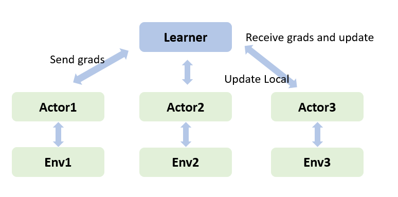

# Asynchronous Advantage Actor-critic Algorithm (A3C)

## Related Paper

1. Mnih V,  Badia A P,  Mirza M, et al. [Asynchronous Methods for Deep Reinforcement Learning](https://arxiv.org/abs/1602.01783?context=cs)

A3C algorithm is an actor critical algorithm that supports asynchronous update. It generates experience data through the interaction of multiple actors with multi environments, and calculates the gradients of each actor's network through these experience data. These gradients will be asynchronously send to the learner to update the weight, and latest weight will cover the network of the actor. Due to the asynchronous mechanism, each actor has the global latest weight when updating, which ensures that the algorithm continues to develop in a good direction and makes the update more efficient.



## Game that this algorithm used

A3C use  an open source reinforcement learning environment library called  [Gym](https://github.com/openai/gym) which is developed by OpenAI. Compared with the single actor structure of A2C, A3C introduces the asynchronous execution of multiple actors to improve the sampling efficiency.

The game solved in A3C from Gym is [**CartPole-v0**](https://www.gymlibrary.dev/environments/classic_control/cart_pole/). "A pole is attached by an un-actuated joint to a cart, which moves along a frictionless track. The system is controlled by applying a force of +1 or -1 to the cart. The pendulum starts upright, and the goal is to prevent it from falling over."[1](https://www.gymlibrary.dev/environments/classic_control/cart_pole/)


## How to run A3C

Before running A3C, you should first install [MindSpore](https://www.mindspore.cn/install) and MindSpore-Reinforcement. Besides, you should also install following dependencies. Please follow the instruction on the official website.

- MindSpore > 2.0.0
- Reinforcement > 0.6
- numpy >= 1.17.0
- [gym](https://github.com/openai/gym) >= 0.18.3

After installation, you can directly use the following command to run the A3C algorithm.

### Train

### Standalone Training

Take the single node with 4 GPUs (1 learner + 3 actors) as an example:

```shell
> cd example/a3c/
> bash run_standalone.sh 4
```

### Distribute Training

Take the dual computer with 4 GPUs (1 learner + 3 actors) as an example, first launch the scheduler on node1 for network management. You need to set the IP and port of the scheduler.
Then, launch two workers in node1 and node2 respectively, and set the IP and port of the corresponding scheduler.

```shell
> cd example/a3c/
> bash run_distribute.sh scheduler 4 [ip] [port] # on node1
> bash run_distribute.sh worker 4 2 [ip] [port] # on node1
> bash run_distribute.sh worker 4 2 [ip] [port] # on node2
```

You will obtain outputs which is similar with the things below in `a3c/worker_0.txt`.

```shell
Train in actor 0, episode 0, rewards 13, loss 102.990003983
Train in actor 0, episode 1, rewards 8, loss 96.347625657
Train in actor 0, episode 2, rewards 25, loss 34.082636394
Train in actor 0, episode 3, rewards 47, loss 45.092653245
Train in actor 0, episode 4, rewards 168, loss 64.23145143
Train in actor 0, episode 5, rewards 21, loss 32.53667883
Train in actor 0, episode 6, rewards 42, loss 54.13416578
Train in actor 0, episode 7, rewards 29, loss 52.45465789
Train in actor 0, episode 8, rewards 107, loss 32.86542446
Train in actor 0, episode 9, rewards 56, loss 22.34567676
```

## Supported Platform

A3C algorithm supports Ascend and GPU platform.
