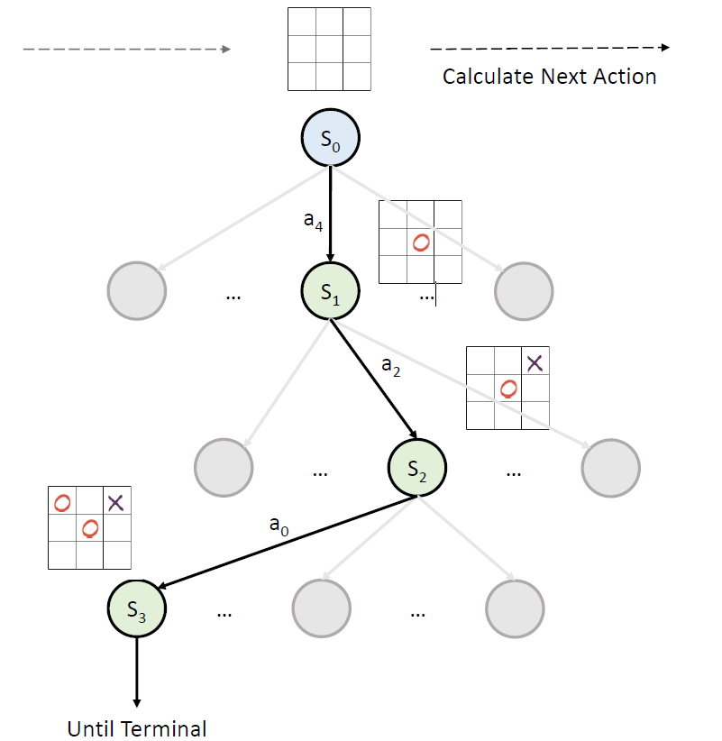

# Monte Carlo Tree Search

## Related Paper

Coulom, 2006 [Efficient Selectivity and Backup Operators in Monte-Carlo Tree Search](https://link.springer.com/chapter/10.1007/978-3-540-75538-8_7)

## What is Monte Carlo Tree Search

Monte Carlo Tree Search (MCTS) is a decision-making algorithm. After the success of MCTS-based reinforcement algorithms, such as AlphaGo, MCTS is widely used in reinforcement learning algorithm. MindSpore Reinforcement v0.5.0 provides a generic MCTS framework which is easy to extend. Developers can not only directly invoke built-in MCTS algorithm which are provided by framework in their reinforcement learning algorithm, but also can provide their own MCTS logic. Framework will optimize the execution of MCTS by automatically compile the algorithm to MindSpore computational graph.



## Game that this algorithm used

In the current MCTS, we use Tic-Tac-Toe as the environment. [Tic-tac-toe](en.wikipedia.org/wiki/Tic-tac-toe) is a paper-and-pencil game for two players who take turns marking the spaces in a three-by-three grid with *X* or *O*. The player who succeeds in placing three of their marks in a horizontal, vertical, or diagonal row is the winner.

## How to run MCTS

```python
python mcts_demo.py
```

## Supported Platform

MCTS supports GPU and CPU.
