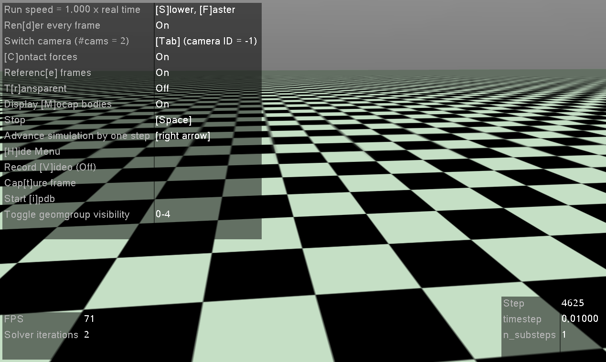

# Proximal Policy Optimization (PPO)

## Related Paper

1. Schulman, John, et al. ["Proximal policy optimization algorithm"](https://arxiv.org/pdf/1707.06347.pdf)

## Game that this algorithm used

PPO uses  an open source reinforcement learning environment library called [Gym](https://github.com/openai/gym), which is developed by OpenAI.

The game solved in PPO is called [**HalfCheetah-v2**](https://www.gymlibrary.ml/environments/mujoco/half_cheetah/), it is from Gym, but this game depends on an advanced physics simulation called [MuJoCo](https://github.com/openai/mujoco-py).



## How to run PPO

Before running PPO, you should first install [MindSpore](https://www.mindspore.cn/install) and MindSpore-Reinforcement. Besides, you should also install following dependencies. Please follow the instruction on the official website.

- MindSpore >= 1.6.0

- numpy >= 1.17.0
- matplotlib >=3.1.3
- [gym](https://github.com/openai/gym) >= 0.18.3
- [mujoco-py](https://github.com/openai/mujoco-py)<2.2,>=2.1

After installation, you can directly use the following command to run the PPO algorithm.

For comprehensive performance considerations on CPU, it is recommended to set `OMP_NUM_THREADS` and configure a unified configuration to 1/4 of the number of physical cores, such as export `OMP_NUM_THREADS=32`(edit in `run_standalone_train.sh`).

### Train

```shell
> cd example/ppo/scripts
> bash run_standalone_train.sh [EPISODE](optional) [DEVICE_TARGET](optional)
```

You will obtain outputs which is similar with the things below in `ppo_train_log.txt`.

```shell
Episode 0, loss is 90.738, reward is -165.2470.
Episode 1, loss is 26.225, reward is -118.340.
Episode 2, loss is 28.407, reward is -49.168.
Episode 3, loss is 46.766, reward is 11.567.
Episode 4, loss is 81.542, reward is 70.142.
Episode 5, loss is 101.262, reward is 131.269.
Episode 6, loss is 95.097, reward is 198.397.
Episode 7, loss is 97.289, reward is 232.347.
Episode 8, loss is 133.97, reward is 260.215.
Episode 9, loss is 112.115, reward is 296.540.
Episode 10, loss is 123.75, reward is 314.946.
Episode 11, loss is 140.75, reward is 315.864.
Episode 12, loss is 157.439, reward is 442.881.
Episode 13, loss is 217.987, reward is 477.359.
Episode 14, loss is 199.457, reward is 461.781.
Episode 15, loss is 194.124, reward is 448.245.
Episode 16, loss is 199.476, reward is 534.768.
Episode 17, loss is 210.211, reward is 535.590.
Episode 18, loss is 207.483, reward is 568.602.
Episode 19, loss is 216,794, reward is 637.380.
-----------------------------------------
Evaluate result for episode 20 total rewards is 782.709
-----------------------------------------
```

### Eval

```shell
> cd example/ppo/scripts
> bash run_standalone_eval.sh [CKPT_FILE_PATH] [DEVICE_TARGET](optional)
```

You will obtain outputs which is similar with the things below in `ppo_eval_log.txt`.

```shell
Load file /path/ckpt/actor_net/actor_net_950.ckpt
-----------------------------------------
Evaluate result is 6000.300, checkpoint file in /path/ckpt/actor_net/actor_net_950.ckpt
-----------------------------------------
```

### Distributed training

We provides three distributed training modes for PPO(only GPU is supported), which are stored in `distribute_policy_3`, `distribute_policy_1` and `distribute_policy_2` under `example/ppo/src/` respectively. It requires a certain knowledge of distributed training, please refer to [Distributed training demo](https://www.mindspore.cn/tutorials/experts/en/master/parallel/train_gpu.html) and [Distributed configuration](https://www.mindspore.cn/docs/en/master/faq/distributed_parallel.html)。

We provides preset scripts that can directly run the single machine with multi-cards, `example/ppo/scripts/*_local.sh`；You can also run the multi-machines with multi-cards by creating a new `hostfile` under `example/ppo/scripts/`. The `hostfile` describes the IP and the number of GPU cards available for multi machines. For example:

```shell
10.0.1.1 slots=4
10.0.1.2 slots=4
```

Run multi-machines with multi-casds case:

```shell
> cd example/ppo/scripts
> bash run_distribute_policy_1_cluster.sh
```

You will obtain outputs which is similar with the things below in  `example/ppo/scripts/ppo_distribute_policy_1_cluster.log`.

```shell
Assign fragment 3 on worker 3
Assign fragment 2 on worker 2
Assign fragment 1 on worker 1
Assign fragment 0 on worker 0
Assign fragment 4 on worker 4
Assign fragment 5 on worker 5
Assign fragment 6 on worker 6
Assign fragment 7 on worker 7
Start fragment 3 on worker 3
Start fragment 1 on worker 1
Start fragment 2 on worker 2
Start fragment 4 on worker 4
Start fragment 5 on worker 5
Start fragment 7 on worker 7
Start fragment 6 on worker 6
Start fragment 0 on worker 0
episode: 0, reward: -127.0022
episode: 0, reward: -134.23423
episode: 0, reward: -132.56445
episode: 0, reward: -135.54523
episode: 0, reward: -129.30974
episode: 0, reward: -126.03343
episode: 0, reward: -135.12637
episode training time: 30.8687823688723s
--------------------------

episode: 1, reward: -58.098632
episode: 1, reward: -60.983003
episode: 1, reward: -54.672389
episode: 1, reward: -61.097635
episode: 1, reward: -60.176465
episode: 1, reward: -58.143202
episode: 1, reward: -57.098376
episode training time: 13.2300376433433s
--------------------------
```

## Supported Platform

PPO algorithm supports  GPU and CPU platform.
