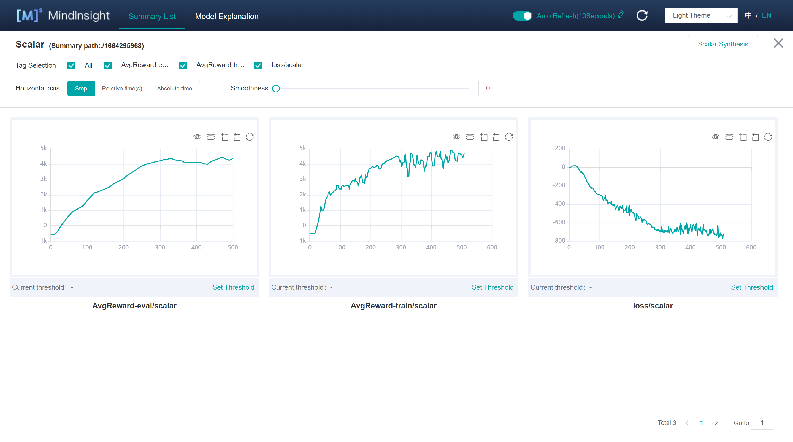

# Twin Delayed Deep Deterministic Policy Gradient (TD3)

## Related Paper

1. Scott Fujimoto, Herke van Hoof, et al. ["Addressing Function Approximation Error in Actor-Critic Methods"](https://arxiv.org/pdf/1802.09477.pdf)
2. David Silver, Guy Lever, et al. ["Deterministic Policy Gradient Algorithms"](https://proceedings.mlr.press/v32/silver14.pdf)

## Game that this algorithm used

Same as DDPG algorithm, TD3 algorithm applies an open source reinforcement learning library named [Gym](https://github.com/openai/gym). Developed by OpenAI company, Gym provides various games for training different reinforcement algorithms.

TD3 has solved the game called [HalfCheetah-v2](https://www.gymlibrary.ml/environments/mujoco/half_cheetah/) in OpenAI Gym. If you would like to run this game, implement and train TD3 algorithm, it is necessary to install an additional library named [MuJoCo](https://github.com/openai/mujoco-py). The interface of this game is shown below (image from https://www.gymlibrary.dev/environments/mujoco/half_cheetah/):


## How to run TD3

Before running TD3, you should first install [MindSpore](https://www.mindspore.cn/install/en)(>=1.7.0) and [MindSpore-Reinforcement](https://www.mindspore.cn/reinforcement/docs/en/r0.5/reinforcement_install.html). Besides, the following dependencies should be installed. Please follow the installation instructions on their official websites.

- [MindInsight](https://mindspore.cn/mindinsight/docs/en/r1.8/mindinsight_install.html) (whose version should be same as installed MindSpore in your device. Installation via pip is recommended.)
- numpy >= 1.22.0
- [gym](https://github.com/openai/gym) <= 0.21.3
- [mujoco-py](https://github.com/openai/mujoco-py)<2.2,>=2.1

It has been practical to monitor the training process of TD3 on [MindInsight](https://mindspore.cn/mindinsight/docs/en/r1.8/index.html)dashboard, which is convenient for users to witness the real-time results returned from training process.

### Train

```shell
> cd example/td3/scripts
> bash run_standalone_train.sh [EPISODE](Optional) [DEVICE_TARGET](Optional)
```

#### Parameters Illustration

- `EPISODE`：total training episode of TD3 and equals to the sum of running games. Default is `2000`.
- `DEVICE_TARGET`：target device for training and chosen one among `Auto`,`CPU` and `GPU`. Default is `GPU`.

You will obtain outputs which is similar to the following lines in `td3_train_log.txt`.

```shell
Episode 691 has 1000.0 steps, cost time: 2943.193 ms, per step time: 2.943 ms
Episode 691: loss is -1096.728, rewards is 6039.843
Episode 692 has 1000.0 steps, cost time: 3090.188 ms, per step time: 3.090 ms
Episode 692: loss is -1100.922, rewards is 6106.94
Episode 693 has 1000.0 steps, cost time: 3133.215 ms, per step time: 3.133 ms
Episode 693: loss is -1084.129, rewards is 5324.56
Episode 694 has 1000.0 steps, cost time: 2941.922 ms, per step time: 2.942 ms
Episode 694: loss is -1085.789, rewards is 4138.977
Episode 695 has 1000.0 steps, cost time: 3191.591 ms, per step time: 3.192 ms
Episode 695: loss is -1093.76, rewards is 5302.855
Episode 696 has 1000.0 steps, cost time: 3027.516 ms, per step time: 3.028 ms
Episode 696: loss is -1095.033, rewards is 5111.147
Episode 697 has 1000.0 steps, cost time: 3169.541 ms, per step time: 3.170 ms
Episode 697: loss is -1076.511, rewards is 4854.681
Episode 698 has 1000.0 steps, cost time: 3140.257 ms, per step time: 3.140 ms
Episode 698: loss is -1108.791, rewards is 5507.21
Episode 699 has 1000.0 steps, cost time: 3124.557 ms, per step time: 3.125 ms
Episode 699: loss is -1077.485, rewards is 5656.699
Episode 700 has 1000.0 steps, cost time: 3207.832 ms, per step time: 3.208 ms
Episode 700: loss is -1102.35, rewards is 5428.018
-----------------------------------------
Evaluate for episode 700 total rewards is 6000.618
-----------------------------------------
```

#### Start MindInsight Dashboard

```python
> mindinsight start --summary-base-dir ./summary
```

MindInsight has been integrated into this algorithm. Records in training process will be store in the folder name `summary` where training script runs whether MindInsight starts or not.

If you had installed MindInsight, it can be opened as long as you visit `http://127.0.0.1:8080` in your browser most of the time. Click on "Training Dashboard" and enter target directory, you will find the visualised output data just like the image below.



### Evaluation

```shell
> cd example/ddpg/scripts
> bash run_standalone_eval.sh [CKPT_FILE_PATH] [DEVICE_TARGET](optional)
```

You will obtain outputs which is similar with the things below in `td3_eval_log.txt`.

```shell
Load file  ./ckpt/actor_net/actor_net_1800.ckpt
-----------------------------------------
Average evaluate result is 7896.422, checkpoint file in ./ckpt/actor_net/actor_net_1800.ckpt
-----------------------------------------
```

## Supported Platform

TD3 algorithm supports GPU and CPU platform and achieves better performance in GPU environment.
