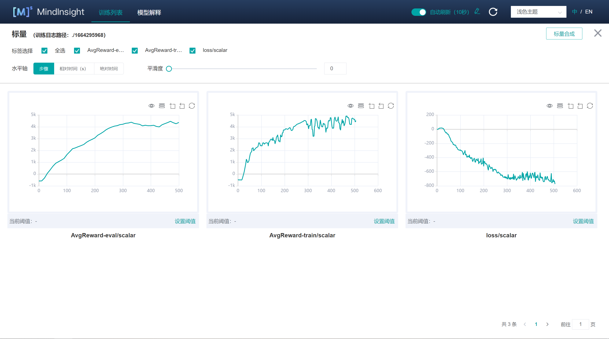

# Twin Delayed Deep Deterministic Policy Gradient (TD3)

## 相关论文

1. Scott Fujimoto, Herke van Hoof, et al. ["Addressing Function Approximation Error in Actor-Critic Methods"](https://arxiv.org/pdf/1802.09477.pdf)
1. David Silver, Guy Lever, et al. ["Deterministic Policy Gradient Algorithms"](https://proceedings.mlr.press/v32/silver14.pdf)

## 使用的游戏

与DDPG算法一样，TD3算法使用的是由OpenAI开发的强化学习环境库[Gym](https://github.com/openai/gym)。该环境提供了多种游戏，可用来训练不同的强化学习算法。

同样，TD3解决了[HalfCheetah-v2](https://www.gymlibrary.ml/environments/mujoco/half_cheetah/)游戏。如果要运行这个游戏，训练TD3算法，则必须要安装[MuJoCo](https://github.com/openai/mujoco-py)这个库。游戏界面示意图如下(图源:https://www.gymlibrary.dev/environments/mujoco/half_cheetah/)：


## 如何运行TD3

在运行TD3前，首先需要安装[MindSpore](https://www.mindspore.cn/install)(>=1.7.0)和[MindSpore-Reinforcement](https://mindspore.cn/reinforcement/docs/zh-CN/r0.5/reinforcement_install.html)。除此之外，还需要安装以下依赖。请根据官网的教程安装。

- [MindInsight](https://mindspore.cn/mindinsight/docs/zh-CN/r1.8/mindinsight_install.html) (版本必须与已经安装的MindSpore的相同，建议使用pip安装)
- numpy >= 1.22.0
- [gym](https://github.com/openai/gym) <= 0.21.3
- [mujoco-py](https://github.com/openai/mujoco-py)<2.2,>=2.1

TD3算法的训练过程目前已支持在[MindInsight](https://mindspore.cn/mindinsight/docs/zh-CN/r1.8/index.html)可视化面板上显示，方便用户实时监控训练过程中返回的结果。

### 训练

```shell
> cd example/td3/scripts
> bash run_standalone_train.sh [EPISODE](可选) [DEVICE_TARGET](可选)
```

#### 参数说明

- `EPISODE`：TD3算法训练的episode总数，即算法训练时需要运行的游戏局数，默认为`2000`
- `DEVICE_TARGET`：指定训练的设备，可选择`Auto`,`CPU`或`GPU`，默认为`GPU`

您会在`example/td3/scripts/td3_train_log.txt`中获得和下面内容相似的输出

```shell
Episode 691 has 1000.0 steps, cost time: 2943.193 ms, per step time: 2.943 ms
Episode 691: loss is -1096.728, rewards is 6039.843
Episode 692 has 1000.0 steps, cost time: 3090.188 ms, per step time: 3.090 ms
Episode 692: loss is -1100.922, rewards is 6106.94
Episode 693 has 1000.0 steps, cost time: 3133.215 ms, per step time: 3.133 ms
Episode 693: loss is -1084.129, rewards is 5324.56
Episode 694 has 1000.0 steps, cost time: 2941.922 ms, per step time: 2.942 ms
Episode 694: loss is -1085.789, rewards is 4138.977
Episode 695 has 1000.0 steps, cost time: 3191.591 ms, per step time: 3.192 ms
Episode 695: loss is -1093.76, rewards is 5302.855
Episode 696 has 1000.0 steps, cost time: 3027.516 ms, per step time: 3.028 ms
Episode 696: loss is -1095.033, rewards is 5111.147
Episode 697 has 1000.0 steps, cost time: 3169.541 ms, per step time: 3.170 ms
Episode 697: loss is -1076.511, rewards is 4854.681
Episode 698 has 1000.0 steps, cost time: 3140.257 ms, per step time: 3.140 ms
Episode 698: loss is -1108.791, rewards is 5507.21
Episode 699 has 1000.0 steps, cost time: 3124.557 ms, per step time: 3.125 ms
Episode 699: loss is -1077.485, rewards is 5656.699
Episode 700 has 1000.0 steps, cost time: 3207.832 ms, per step time: 3.208 ms
Episode 700: loss is -1102.35, rewards is 5428.018
-----------------------------------------
Evaluate for episode 700 total rewards is 6000.618
-----------------------------------------
```

#### 启动MindInsight训练看板

```python
> mindinsight start --summary-base-dir ./summary
```

本算法已集成MindInsight。无论是否打开训练面板，算法都会在运行训练脚本的目录下，记录训练数据到`summary`文件夹中。

如果您已经安装了MindInsight，一般情况下访问`http://127.0.0.1:8080`，即可打开MindInsight。点击对应目录下的“查看训练面板”，即可将训练输出的数据可视化出来。如下图所示。



### 推理

```shell
> cd example/td3/scripts
> bash run_standalone_eval.sh [CKPT_PATH] [DEVICE_TARGET](可选)
```

你会在`example/td3/scripts/td3_eval_log.txt`中获得和下面内容相似的输出

```shell
Load file  ./ckpt/actor_net/actor_net_1800.ckpt
-----------------------------------------
Average evaluate result is 7896.422, checkpoint file in ./ckpt/actor_net/actor_net_1800.ckpt
-----------------------------------------
```

## 支持平台

TD3算法支持GPU和CPU，且在GPU环境下取得较好的性能。
